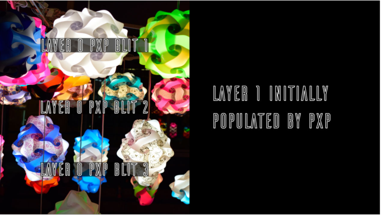
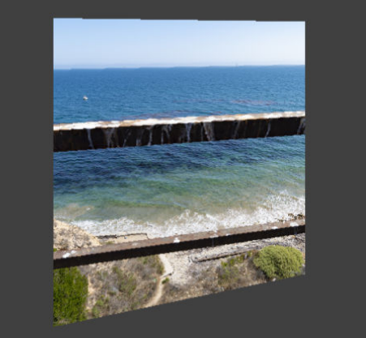

# NXP Application Code Hub
[](https://www.nxp.com)

## AN13075：i.MX RT1170 Heterogeneous Graphics Pipeline
The i.MX RT1170 crossover MCU features several options to generate, compose, and blend graphics content before sending it to a display: 

1. 2D Vector Graphics GPU: This engine can render scalable vector graphics and compose and manipulate bitmaps. 

1. PXP Graphics Accelerator: This 2D engine can manipulate and blend bitmaps, its main features are scaling, fixed-angle rotation and color space conversion. 

1. LCDIF: The display controller allows you to create up to eight display layers, offering on-the-fly blending capabilities with multi-format support. 

This application note gives a brief overview of each one of the engines, how to initialize them, use them independently, and finally, it introduces a use case on how to use them in unison to get a performance and resource boost. Each stage has an associated software project to make things easier.

Please refer to AN13075 for complete instructions on how to use this software.

https://www.nxp.com/docs/en/application-note/AN13075.pdf

#### Boards: MIMXRT1170-EVK, MIMXRT1170-EVKB
#### Categories: Graphics
#### Peripherals: DISPLAY
#### Toolchains: IAR

## Table of Contents
1. [Software](#step1)
2. [Hardware](#step2)
3. [Setup](#step3)
4. [Results](#step4)
5. [FAQs](#step5) 
6. [Support](#step6)
7. [Release Notes](#step7)

## 1. Software<a name="step1"></a>

The software for this Application Note is delivered in raw source files based on MCUXpresso SDK and IAR projects.

- MCUXpresso SDK 2.12.0
- IAR Embedded Workbench for Arm, Version is 9.30.1 or later

## 2. Hardware<a name="step2"></a>

- MIMXRT1170-EVK (all Rev boards are supported)
- RK055HDMIPI4M or RK055HDMIPI4MA0 MIPI display panel
- Micro USB Cable
- Personal computer


## 3. Setup<a name="step3"></a>
1. Connect a USB cable between the host PC and the debug probe USB ort on the target board.
1. Open a serial terminal with the following settings:
   - 115200 baud rate
   - 8 data bits
   - No parity
   - One stop bit
   - No flow control
1. Open an example under boards\evkmimxrt1170\vglite_appnote_samples
1. Change the display definition in display_support.h for your display panel.
1. Change build configuration, default configuratin is *sdram_debug*, and compile the example project.
1. Download the built image to the board through debug proble USB port and run the example.

## 4. Results<a name="step4"></a>
The similar log below shows the output of the examples in the terminal window:
```
61 frames in 1 seconds: 56 fps
61 frames in 1 seconds: 56 fps
```
The detail of output log depends on the specific examples. The 2D graphics assets described in the AN will be showed on the screen. See below pictures for details:
- LCDIF_PXP

   

- LCDIF_VGLite 

   

- Map, Map_PXP_LCDIF_SingleTask, and Map_PXP_SingleTask use 3 different methods to implement the same application GUI. 

   

- Example NXPLogo shows VGLite vector rendering with 6 different parameters. Modifying the macros **TEST_STEP** in `NXPLogo.c` shows the results of each parameter. 

   

- Example VGLiteBlit shows VGLite raster rendering with 6 different settings. Modifying the macros **TEST_STEP** in the `VGLiteBlit.c` to get the different result of each setting. 

   


## 5. FAQs<a name="step5"></a>

## 6. Support<a name="step6"></a>

The details for this demo are all recorded in the application note - [AN13075](https://www.nxp.com/docs/en/application-note/AN13075.pdf) i.MX RT1170 Heterogeneous Graphics Pipeline.

#### Project Metadata
<!----- Boards ----->
[](https://github.com/search?q=org%3Anxp-appcodehub+MIMXRT1170-EVK+in%3Areadme&type=Repositories) [](https://github.com/search?q=org%3Anxp-appcodehub+MIMXRT1170-EVKB+in%3Areadme&type=Repositories)

<!----- Categories ----->
[](https://github.com/search?q=org%3Anxp-appcodehub+graphics+in%3Areadme&type=Repositories)

<!----- Peripherals ----->
[](https://github.com/search?q=org%3Anxp-appcodehub+display+in%3Areadme&type=Repositories)

<!----- Toolchains ----->
[](https://github.com/search?q=org%3Anxp-appcodehub+iar+in%3Areadme&type=Repositories)

Questions regarding the content/correctness of this example can be entered as Issues within this GitHub repository.

>**Warning**: For more general technical questions regarding NXP Microcontrollers and the difference in expected funcionality, enter your questions on the [NXP Community Forum](https://community.nxp.com/)

[](https://www.youtube.com/@NXP_Semiconductors)
[](https://www.linkedin.com/company/nxp-semiconductors)
[](https://www.facebook.com/nxpsemi/)
[](https://twitter.com/NXP)

## 7. Release Notes<a name="step7"></a>
| Version | Description / Update                           | Date                        |
|:-------:|------------------------------------------------|----------------------------:|
| 1.0     | Initial release on Application Code HUb        | June 12<sup>th</sup> 2023 |

